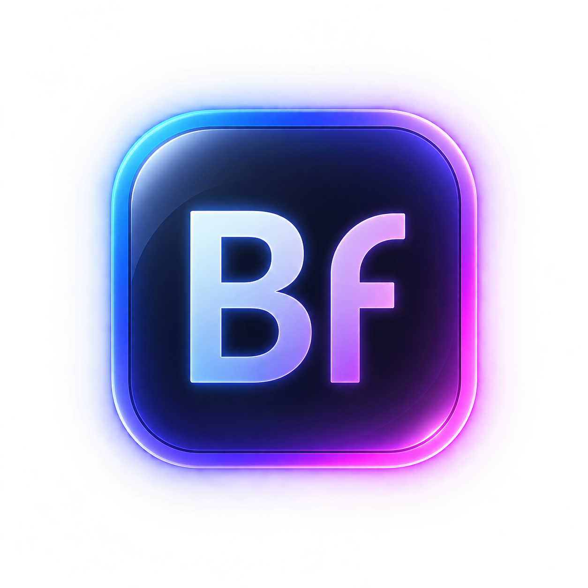
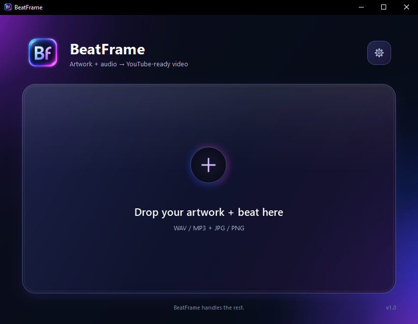

<p align="center">
  
</p>

<h1 align="center">BeatFrame</h1>

<p align="center">
  <strong>Turn artwork + audio into YouTube-ready videos.</strong>
</p>

<p align="center">
  A lightweight desktop app for producers who want to spend less time exporting videos and more time making music.
</p>

<p align="center">
  
</p>

---

## What is BeatFrame?

BeatFrame turns a still image and a beat into a finished, YouTube-ready MP4.

Drop in your artwork and a WAV or MP3 file. BeatFrame handles the video creation, visual fades, optional intro, encoding, and export automatically.

No video editor. No timeline. No repetitive export setup.

**Artwork + beat → finished video.**

## Features

- Drag & drop workflow
- WAV and MP3 audio support
- JPG and PNG artwork support
- Automatic 1920×1080 video creation
- Optional intro video
- Adjustable visual fade in/out
- Automatic rendering after drop
- Render queue for multiple beats
- Custom output folder
- Automatic filename collision handling
- Native Windows taskbar render progress
- FFmpeg included with the Windows release

Your source beat is never faded or volume-adjusted. Visual fades affect the video only.

## How to use

1. Open BeatFrame.
2. Configure your settings once.
3. Drop one artwork file and one beat into the app.
4. BeatFrame renders the video automatically.
5. Upload the finished MP4 to YouTube.

That's it.

## Output

BeatFrame is designed around a high-quality YouTube upload workflow.

| Setting | Output |
| --- | --- |
| Resolution | 1920×1080 |
| Frame rate | 23.976 fps |
| Video | H.264 |
| Pixel format | yuv420p |
| Audio | AAC-LC |
| Audio bitrate | 384 kbps |
| Sample rate | 48 kHz |
| Channels | Stereo |

Beat audio is encoded independently before the final video is assembled. When an intro is used, the encoded beat audio is preserved through the final mux without another lossy audio encode.

## Intro videos

BeatFrame can prepend an intro video before the beat.

The intro plays completely first, followed by the artwork and beat from the beginning.

Your selected intro is remembered between sessions, so it only needs to be configured once.

## Queue

Need to render more than one beat?

Drop additional artwork + audio pairs while a render is running and BeatFrame will add them to the queue automatically.

Each queued job keeps the settings that were active when it was added.

## Download

### Windows

Windows builds are available from the **Releases** section of this repository.

> BeatFrame v1.0 currently targets Windows. macOS support is planned and will be published after the macOS build has been packaged and tested.

## Build from source

BeatFrame is written in Python using PySide6 and uses FFmpeg for media processing.

### Requirements

- Python 3.9+
- FFmpeg and ffprobe
- PySide6

Clone the repository:

```bash
git clone https://github.com/Samtoussi/beatframe.git
cd beatframe
```

Create a virtual environment:

```bash
python -m venv .venv
```

Activate it.

**Windows**

```powershell
.\.venv\Scripts\Activate.ps1
```

**macOS / Linux**

```bash
source .venv/bin/activate
```

Install dependencies:

```bash
pip install -r requirements.txt
```

Run BeatFrame:

```bash
python app.py
```

When running from source, BeatFrame will use bundled FFmpeg/ffprobe binaries when available and otherwise fall back to the versions available on your system PATH.

## Windows build

The Windows release is packaged with PyInstaller.

The local build expects:

```text
bin/
├── ffmpeg.exe
└── ffprobe.exe
```

Then build using the included PyInstaller spec:

```powershell
pyinstaller --noconfirm --clean BeatFrame.spec
```

The packaged application will be created under:

```text
dist/BeatFrame/
```

The `bin/`, `build/`, and `dist/` directories are intentionally excluded from Git.

## Why BeatFrame?

BeatFrame started from a simple problem: exporting beat videos shouldn't take longer than necessary.

For a workflow built around still artwork and finished audio, opening a full video editor, rebuilding the same timeline, configuring the same export settings, and waiting for another export adds repetitive work without adding anything creative.

BeatFrame removes that part of the process.

**Make the beat. Drop the files. BeatFrame handles the rest.**

## Third-party software

BeatFrame uses [FFmpeg](https://ffmpeg.org/) for media processing.

Windows distributions of BeatFrame may include FFmpeg binaries containing components distributed under their respective open-source licenses, including GPL-licensed components such as x264.

FFmpeg and x264 are separate third-party projects and are not owned by or affiliated with BeatFrame.

Additional license and source information for bundled third-party components is provided with the distributed release.

## License

BeatFrame licensing information will be provided with the v1.0 release.

---

<p align="center">
  <strong>BeatFrame</strong><br>
  Artwork + audio → YouTube-ready video.
</p>